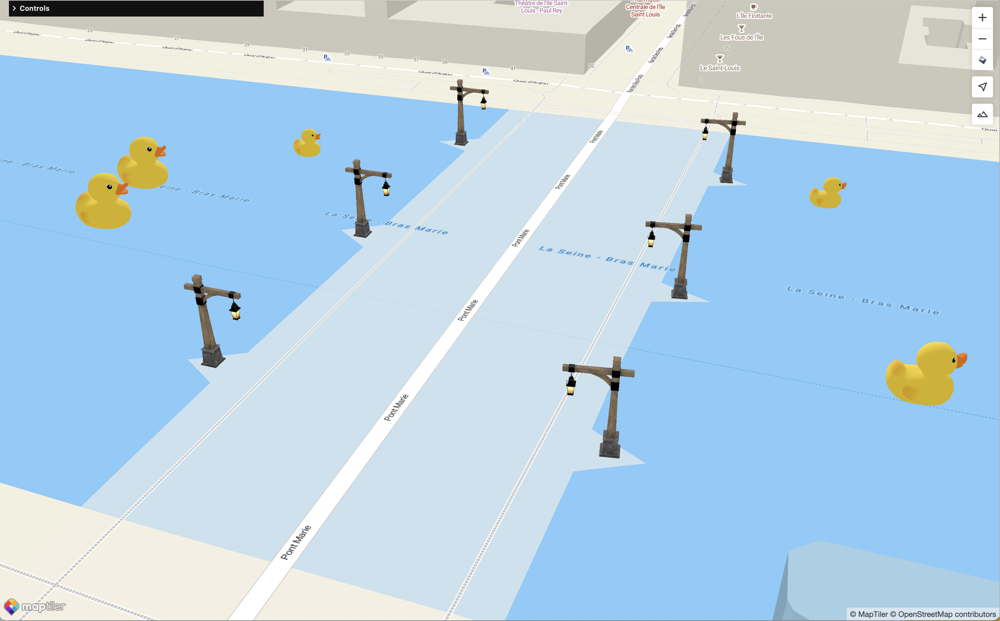

<p align="center">
<a href="https://docs.maptiler.com/sdk-js/modules/3d/">official page →</a><br>
  
</p>

<p align="center" style="color: #AAA">
  Add 3D objects and lighting to your <a href="https://docs.maptiler.com/sdk-js">MapTiler SDK JS</a> maps
</p>

<p align="center">
  
  
  </img>
  </img>
</p>

## 3D objects on MapTiler maps
With this MapTiler SDK plugin, you can add 3D objects (glTF/glb files) to your basemap, with plenty of customizations!

[Sellers Mansion, captured by Katie Wolfe, License CC Attribution](https://sketchfab.com/3d-models/sellers-mansion-4aad9d86ec5e484c949e931b67a4243f)


[Flatiron building, mesh created by Mohamed Hussien, License CC Attribution](https://sketchfab.com/3d-models/flatiron-building-116132645224458da6e4d9dd45c294b4)


[Plane a380, mesh created by Mamont Nikita, License CC Attribution](https://sketchfab.com/3d-models/plane-a340-d3ad0996a8564a94a24ee4b3528b554b)


[Duck and lamp post meshes from the glTF sample asset repository](https://github.com/KhronosGroup/glTF-Sample-Assets)

### Installation
From NPM and using the ES module, in a terminal, in your project:
```shell
npm install @maptiler/3d
```

Then to import:
```ts
import { SceneLayer } from "@maptiler/3d";
// or
import * as maptiler3d from "@maptiler/3d";
```

From CDN and using the UMD bundle, in the `<head></head>` section of your HTML file:
```html
<script src="https://cdn.maptiler.com/maptiler-3d/v1.0.0/maptiler-3d.umd.js"></script>
```

With the UMD bundle (on CDN), the namespace for this project is `maptiler3d`. So the `layer3D` class is available at `maptiler3d.Layer3D`.

### Basic usage
An instance of `Layer3D` is a custom type of layer that contain a 3D scene, where multiple 3D meshes and lights can be added. Like any other layer in MapTiler SDK/Maplibre GL JS, it must have an ID and then be added to a `Map` instance:

```js
// Create a map;
const map = new Map({
  container: "map",
  // ...
});

// Waiting that the map is ready. You can also wait for the "load" event.
map.on("ready", () => {
  
  // Create a SceneLayer and add it
  const layer3D = new maptiler3d.Layer3D("custom-3D-layer");
  map.addLayer(layer3D);
})
```

Once created and added, a mesh can be added. In this version, only *glTF* and their biinary counterpart *glb* files can be added, more formats will be added in the future.

To add a mesh:
```ts
// The call can be awaited for the whole download of the mesh to complete
await layer3D.addMeshFromURL(
  // ID to give to this mesh, unique within this SceneLayer instance
  "flatiron",

  // The URL of the mesh
  "https://example.com/meshes/flatiron_building.glb",

  // A set of options, these can be modified later
  {
    lngLat: {lat: 40.74072950731568, lng: -73.98918779556983},
    heading: 91.1,
    scale: 39.5,
    visible: true,
    altitude: 74.38,
    altitudeReference: maptiler3d.AltitudeReference.GROUND,
  }
);
```

### Reference documentation
The constructor of the `SceneLayer` class takes two arguments:
- a layer ID (as in the example above)
- an option object, with TypeScript, this object is of type `SceneLayerOptions`

Here are more details about the `SceneLayerOptions` type:
```ts
type SceneLayerOptions = {
  /**
   * Bellow this zoom level, the meshes are not visible
   * Default: 0
   */
  minZoom?: number;

  /**
   * Beyond this zoom level, the meshes are not visible.
   * Default: 22
   */
  maxZoom?: number;

  /**
   * Default: true
   */
  antiaslias?: boolean;

  /**
   * Ambient light color.
   * Default: `0xffffff` (white)
   */
  ambientLightColor?: ColorRepresentation,

  /**
   * Ambient light intensity.
   * Default: `1`
   */
  ambientLightIntensity?: number,
};
```

Other important types that are exported:

- About the reference for altitude:
```ts
enum AltitudeReference {
  /**
   * Use the ground as a reference point to compute the altitude
   */
  GROUND = 1,

  /**
   * Uses mean sea level as a reference point to compute the altitude
   */
  MEAN_SEA_LEVEL = 2
};
```
**Example:** A mesh that is add with the option `altitudeReference` being `AltitudeReference.GROUND` and an altitude of `10` will always "fly" 10 meters above the ground, regardless the terrain or the terrain exaggeration. If the provided altitude were to be a negative number, then it would always be beneath the ground surface by this amount (in meters). This mode is convenient for any item that needs to be positions relatively to the ground: cars, buildings, lap post, etc.
On the other hand, mesh that is add with the option `altitudeReference` being `AltitudeReference.MEAN_SEA_LEVEL` and the altitude of `1000` means the item will be at an absolute altitude of 1000 meters (3280 feet) above the mean sea level. If located in a place where the terrain shows mountains higher than 1000 meters, then the mesh will be underneath the ground surface and as such not visible. This mode is more convenient for flying objects such as planes, paraglydings, etc. as those thend to measure altitude with an absolute reference.

- Going from the original 3D space the mesh was created in, to the map 3D space:
```ts
enum SourceOrientation {
  /**
   * The mesh was originaly created in a 3D space that uses the x axis as the up direction
   */
  X_UP = 1,

  /**
   * The mesh was originaly created in a 3D space that uses the Y axis as the up direction
   */
  Y_UP = 2,

  /**
   * The mesh was originaly created in a 3D space that uses the Z axis as the up direction
   */
  Z_UP = 3,
};
```
Note that regardless of the original up axis, this plugin as well as MapTiler SDK/Maplibre GL JS only deal with 3D spaces that follow the [right-hand rule](https://en.wikipedia.org/wiki/Right-hand_rule).

- Generic options that apply to both point lights and meshes:
```ts
type GenericObject3DOptions = {
  /**
   * Position.
   * Default: `[0, 0]` (Null Island)
   */
  lngLat?: LngLatLike,

  /**
   * Altitude above the reference (in meters).
   * Default: `0` for meshes, or `2000000` for point lights.
   */
  altitude?: number,

  /**
   * Reference to compute and adjust the altitude.
   * Default: `AltitudeReference.GROUND` for meshes and `AltitudeReference.MEAN_SEA_LEVEL` for point lights.
   */
  altitudeReference?: AltitudeReference,

  /**
   * Make the object visible or not.
   * Default: `true`
   */
  visible?: boolean;
};
```

- Options for adding meshes specifically:
```ts
type MeshOptions = GenericObject3DOptions & {
  /**
   * Rotation to apply to the model to add, as a Quaternion.
   * Default: a rotation of PI/2 around the x axis, to adjust from the default ThreeJS space (right-hand, Y up) to the Maplibre space (right-hand, Z up)
   */
  sourceOrientation?: SourceOrientation,

  /**
   * Scale the mesh by a factor.
   * Default: no scaling added
   */
  scale?: number,

  /**
   * Heading measured in degrees clockwise from true north.
   */
  heading?: number,
};
```

- Options for adding a point light specifically:
```ts
type PointLightOptions = GenericObject3DOptions & {
  /**
   * Light color.
   * Default: `0xffffff` (white)
   */
  color?: ColorRepresentation,

  /**
   * Intensity of the light.
   * Default: `75`
   */
  intensity?: number,

  /**
   * Decay of the light relative to the distance to the subject.
   * Default: `0.5`
   */
  decay?: number,
};
```

Here is the list of instance methods:
- **`.setAmbientLight(options: {color?: ColorRepresentation, intensity?: number} = {})`**  
To adjust the settings of the ambient light. The type `ColorRepresentation` means the color can be a `number` (such as a hex notation `0xff0000`, for red), a hex string (such as `"#FF0000"`, for red), or a ThreeJS color ([read more about these here](https://threejs.org/docs/#api/en/math/Color)).  
ℹ️ By default, the ambiant light is white (`0xffffff`) with an intensity of `0.5`.

- **`.addMeshFromURL(id: string, meshURL: string, options: MeshOptions = {})`** *async*  
Adds a mesh from a URL to a glTF of glb file, given a mesh ID (will throw if not unique) and a set of options.

- **`.addMesh(id: string, mesh: Mesh | Group | Object3D, options: MeshOptions = {})`**  
Adds a ThreeJS mesh/Group/Object3D, given a mesh ID (will throw if not unique) and a set of options.  
ℹ️ By default, the mesh will have some settings (if not overwritten by the options):
  * sourceOrientation: `SourceOrientation.Y_UP`
  * altitude: `0`
  * lngLat: `[0, 0]`
  * heading: `0`
  * visible: `true`

- **`.modifyMesh(id: string, options: MeshOptions)`**  
Modify the settings of a mesh (scale, lntLat, etc.)  
ℹ️ Only the settings provided in the option object will be updated, the others will be left as they already are.

- **`.cloneMesh(sourceId: string, id: string, options: MeshOptions)`**  
Clones a mesh that has a given ID (`sourceId`) and create another one with a new ID (`id`). The provided options will overwrite the settings of the source mesh.

- `.addPointLight(id: string, options: PointLightOptions = {})`  
Adds a point light with a unique ID (will throw if not unique) and some options.  
ℹ️ By default, the light will have some settings (if not overwritten by the options):
  * lngLat: `[0, 0]` (null island)
  * altitude: `2_000_000` meters
  * altitudeReference: `AltitudeReference.MEAN_SEA_LEVEL`
  * color: `0xffffff` (white)
  * intensity: `75`
  * decay: `0.2`

- `.modifyPointLight(id: string, options: PointLightOptions)`  
Modify a point light given its ID.  
ℹ️ Only the settings provided in the option object will be updated, the others will be left as they already are.


- `.removeMesh(id: string)`  
Remove a mesh or point light from the scene and frees the GPU memory associated to it

- `.clear()`  
Removes all the meshes and point lights from the scene and frees the GPU memory associated with them


## License
MapTiler 3D JS Module

Copyright © 2023 MapTiler AG. All rights reserved.

The software and files (collectively “Software”) in this repository are licensed for use only with MapTiler service(s). 

For the license terms, please reference  [MapTiler General Terms and Conditions](https://www.maptiler.com/terms/) which incorporate MapTiler 3D JS Module Product [Terms (collectively “Terms”) and Privacy Policy at Privacy policy](https://www.maptiler.com/privacy-policy). 

This license allows users with an active MapTiler account to modify and integrate authorized portions of the Software for use with the relevant MapTiler service(s) in accordance with the MapTiler Terms. This license terminates automatically if a user no longer maintains a MapTiler account or their usage breaches MapTiler Terms. 